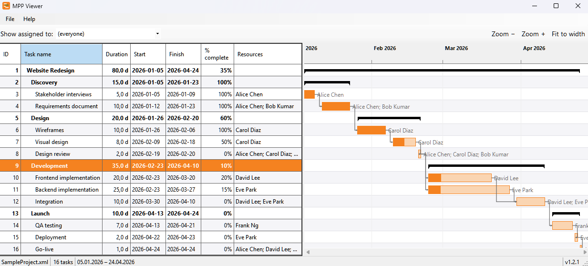
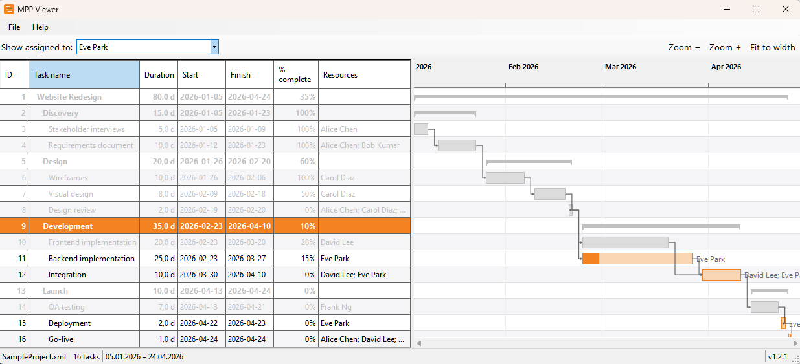

# MPP Viewer


> **Early version (1.2.2)** — a young project under active development. Core viewing works, but the UI and behaviour may change between releases, and some `.mpp` features are not yet rendered. Feedback is welcome.

A portable, **read-only** desktop viewer for Microsoft Project `.mpp` files. It shows the task list and a synchronized Gantt chart side by side — no Microsoft Project installation required.

- **Single `.exe`, no installation** — download, run, done. No admin rights, no setup.
- **Read-only** — opens and displays files; never modifies them.
- **Self-contained** — bundles the .NET runtime; nothing else to install.



## Features

- **Task table** — ID, task name (indented by WBS outline level), duration, start, finish, % complete, and assigned resources. The resource column auto-fits its content and the chart snaps flush to the right of the table.
- **Gantt chart** — task bars on a months timeline with progress fill, Finish-to-Start dependency arrows, and the assigned people shown next to each bar.
- **Synchronized view** — the table and the chart share row stripes and scroll together, so every row lines up with its bar. The mouse wheel over the chart scrolls both panes.
- **Zoom the timeline** — hold `Ctrl` and scroll the mouse wheel over the chart (or use the **Zoom −/+** buttons) to stretch or compress the time axis; the date under the cursor stays put. **Fit to width** scales the whole project to the window, and zooming out never goes below that fit.
- **Jump to a task** — double-click any row to pan the timeline so that task's bar moves to the left edge.
- **Summary tasks highlighted** — parent (roll-up) tasks appear in **bold** in the table and as bracketed bars in the chart.
- **Highlight by person** — the "Show assigned to:" toolbar lists everyone assigned in the file; pick a name to grey out every task not assigned to them (in both panes), or *(everyone)* to clear.



## Requirements

- Windows 10 / 11 (x64)
- No other dependencies — the .NET 8 runtime is bundled in the executable.

## Download & Run

1. Download `MppViewer.exe` from the [latest release](https://github.com/george7979/mpp-viewer/releases/latest).
2. Double-click to run. There is no installer.

### ⚠️ Windows will warn that this app is "unrecognized" — this is expected

`MppViewer.exe` is **not code-signed** (a code-signing certificate is a paid, identity-verified product this hobby project does not have). Windows therefore treats it as an unknown publisher and shows scary-looking warnings. **They do not mean the file is malware** — only that Windows cannot verify who published it. Because the project is open source, you can read every line and [build the exe yourself](#building-from-source) if you prefer not to trust the prebuilt binary.

You will likely hit one or two of these:

**1. Browser download warning.** Edge/Chrome may say the file *"isn't commonly downloaded"* or *"can harm your computer"*. Choose **Keep** / **Keep anyway** (in Edge: click the **···** next to the download → **Keep**).

**2. SmartScreen blue dialog on first launch.** A full-screen blue window appears:

> **Windows protected your PC**
> Microsoft Defender SmartScreen prevented an unrecognized app from starting. Running this app might put your PC at risk.

By default it only shows a **Don't run** button. To run it anyway:

1. Click **More info** (the small link in the dialog).
2. A **Run anyway** button appears — click it.

The app then starts normally, and Windows remembers your choice for that file. (The exact wording may differ depending on your Windows display language.)

## Usage

1. Open a `.mpp` file via **File → Open…** (or press `Ctrl+O`) — or double-click an `.mpp` file in Explorer once you've set MPP Viewer as the default app. Columns auto-fit and the chart snaps to the right of the table.
2. Scroll the table vertically — the chart follows. Use the chart's bottom scrollbar to pan the timeline; the mouse wheel over the chart scrolls both panes.
3. **Zoom the time axis** — hold `Ctrl` and scroll the mouse wheel over the chart (the date under the cursor stays put), or use the **Zoom −/+** buttons. Click **Fit to width** to scale the whole project to the window; zooming out never goes below that fit.
4. **Drag the chart to pan it** — grab the Gantt area with the mouse (or swipe with a finger on a touchscreen) and drag in any direction: left/right scrolls the timeline, up/down scrolls the rows.
5. **Double-click a row** to scroll the timeline to that task.
6. Use **Show assigned to:** on the toolbar to highlight one person's tasks (others are greyed out); pick *(everyone)* to show everyone again.
7. Drag the splitter between the panes to resize them.

The status bar shows the file name, task count, the project's date range, and the app version (bottom-right). **Help → About** shows the version and a clickable link to this repository; **Help → GitHub** opens it directly.

## Scope: one view, project files in

MPP Viewer shows the project in a **single view** — a task list + Gantt chart (the equivalent of Microsoft Project's *Gantt Chart* view). "Gantt" is a *view*, not a file format: a `.mpp` file is a whole project database, and other tools render it in many views.

It reads MS Project **project files** (`.mpp`) and Microsoft Project's **`.xml` (MSPDI)** export. It cannot read non-project *exports* such as PDF, image, or Excel/CSV — those are reports, not project data.

> **Open files you trust.** Like any document viewer, MPP Viewer parses whatever file you open (through the MPXJ library). Opening a deliberately malformed project file from an untrusted source carries the same theoretical risk as with any parser — prefer files you created or received from people you know.

## What it does not do (yet)

This is an early, focused release. Out of scope for now:

- Any editing — the viewer is strictly read-only.
- Other MS Project views — *Network Diagram, Calendar, Resource Sheet, Task/Resource Usage, Team Planner*. Assigned people *are* shown per task, but there's no per-resource view.
- Grouping and column sorting — the table stays in WBS (outline) order.
- Export to PDF / Excel / image.
- Baseline comparison.

## Building from source

Requires the [.NET 8 SDK](https://dotnet.microsoft.com/download).

```bash
# Build and run
dotnet run --project src/MppViewer/MppViewer.csproj

# Run the tests
dotnet test MppViewer.sln

# Produce a portable single-file exe (as CI does)
dotnet publish src/MppViewer/MppViewer.csproj -c Release -r win-x64 \
  --self-contained true /p:PublishSingleFile=true /p:EnableCompressionInSingleFile=true -o publish/
```

## Tech stack

- **.NET 8 + WinForms** — desktop UI, published as a self-contained single file.
- **[MPXJ](https://www.mpxj.org/)** (`net.sf.mpxj`) — reads the `.mpp` format.
- **GitHub Actions** — builds and publishes the `win-x64` executable on every push.

## License

MIT — see [LICENSE](LICENSE).
